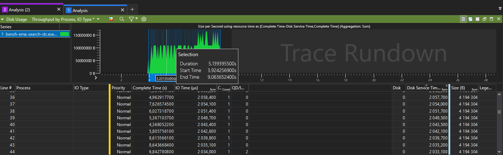
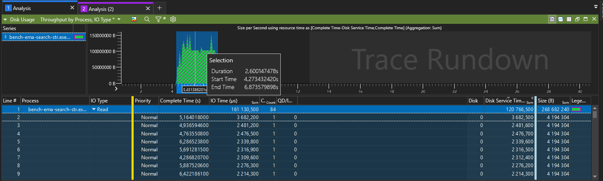

# de_cache

## Обзор кода

- Реализация API для работы с page-кэшом находится в de_cache.cpp
- Абстракции для представления файла и его страниц классе CachedFile в cached_file.cpp
- Страница описана в классе Page в page.cpp
- consts.cpp - всякие константы
- util.cpp - вспомогательные функции
- dllmain.cpp, pch.cpp - служебные файлы для построения DLL в Windows
- DLL делал по [этой инструкции](https://learn.microsoft.com/ru-ru/cpp/build/walkthrough-creating-and-using-a-dynamic-link-library-cpp?view=msvc-170)

## Результаты

- Бенчмарк: `ema_search_str`
- Файл: 256 Мбайт
- Повторений: 2

### Без кэша:

### С кэшем:

## Вывод

Page-cache очень нужен для оптимизации чтения с диска - очевидно)
Причём самописный page-кэш позволяет подобрать параметры страниц и их количества эффективно для алгоритма, тут для блочного чтения с диска я смог подстроить эти параметры так, что мой page-cache обогнал системный

Также можно сделать свой алгоритм вытеснения, в моём случае это MRU, что в целом неплохо для алгоритма бенчмарка ema_search_str.
